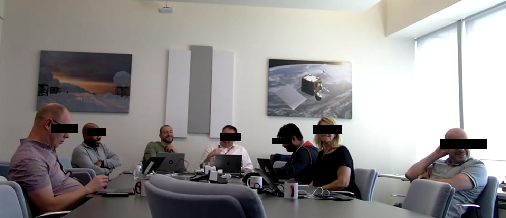

<div align="center">

**Scripts && configs**



━━━━━━━━━━━━━━━━━━━━━━━━━━━━━━━━━━━━━━━━━━━━━━━━━━━━━━━━━━━━━━━━━━━━━━━━

<!-- AUTO:STATS:START -->
**1 module(s)** · **2 files** · **325 lines**
<!-- AUTO:STATS:END -->

</div>

<br>

## `$ cat /etc/motd`

A personal collection of scripts, guides, and automation.

<br>

## `$ tree --dirsfirst`

<!-- AUTO:TREE:START -->
```
repo/
├── .claude
│   └── settings.local.json
├── 2022.jpg
├── 2022.png
├── CLAUDE.md
├── README.md
├── arch-install
│   ├── arch-install_cmds.sh
│   └── arch-install_guide.md
└── tools
    └── generate-readme.sh
```
<!-- AUTO:TREE:END -->

<br>

## `$ ls -la modules/`

<!-- AUTO:MODULES:START -->
<table>
  <tr><th>Module</th><th>Description</th><th></th></tr>
  <tr>
    <td><b><a href="arch-install/arch-install_guide.md">arch-install</a></b></td>
    <td>UEFI + LUKS2 + LVM + systemd-boot | 1TB disk, German layout, Intel CPU</td>
    <td><sub>2 files · 325 lines</sub></td>
  </tr>
</table>
<!-- AUTO:MODULES:END -->

<br>

## `$ head -n3 PHILOSOPHY.md`

```
- Open Source - Open Standard
- No abstraction for abstraction's sake.
```

<br>

━━━━━━━━━━━━━━━━━━━━━━━━━━━━━━━━━━━━━━━━━━━━━━━━━━━━━━━━━━━━━━━━━━━━━━━━

## `$ fortune`

```
"Talk is cheap. Show me the code." — Linus Torvalds
```
